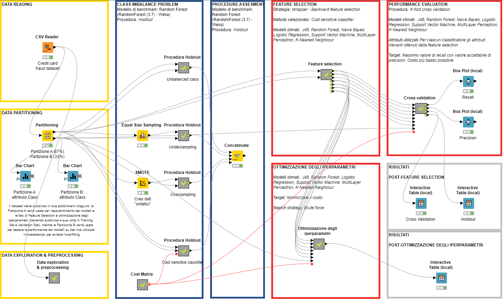
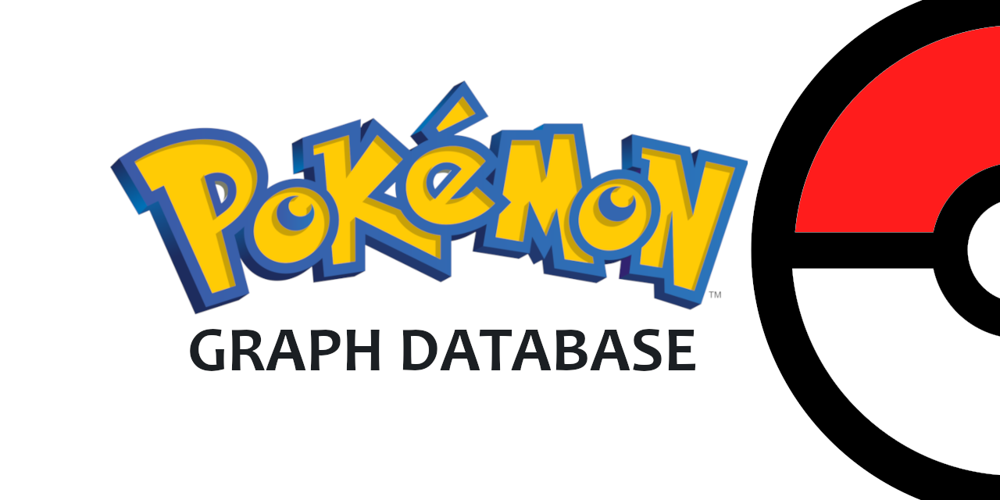
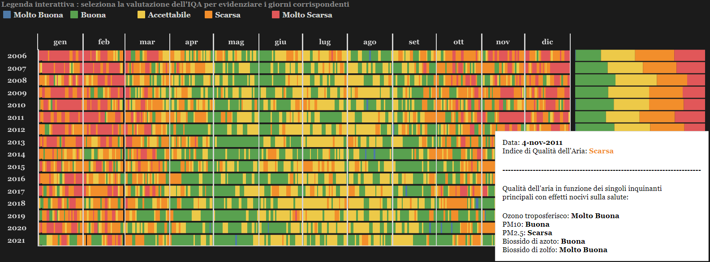
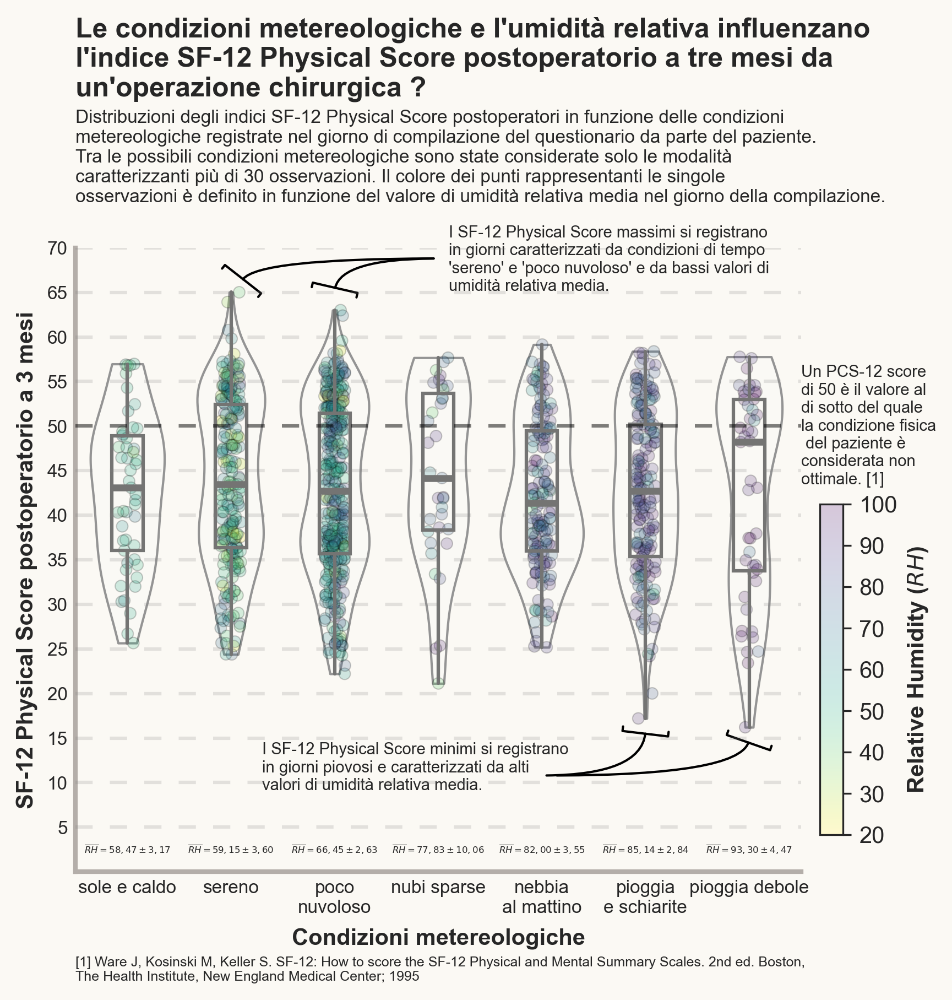
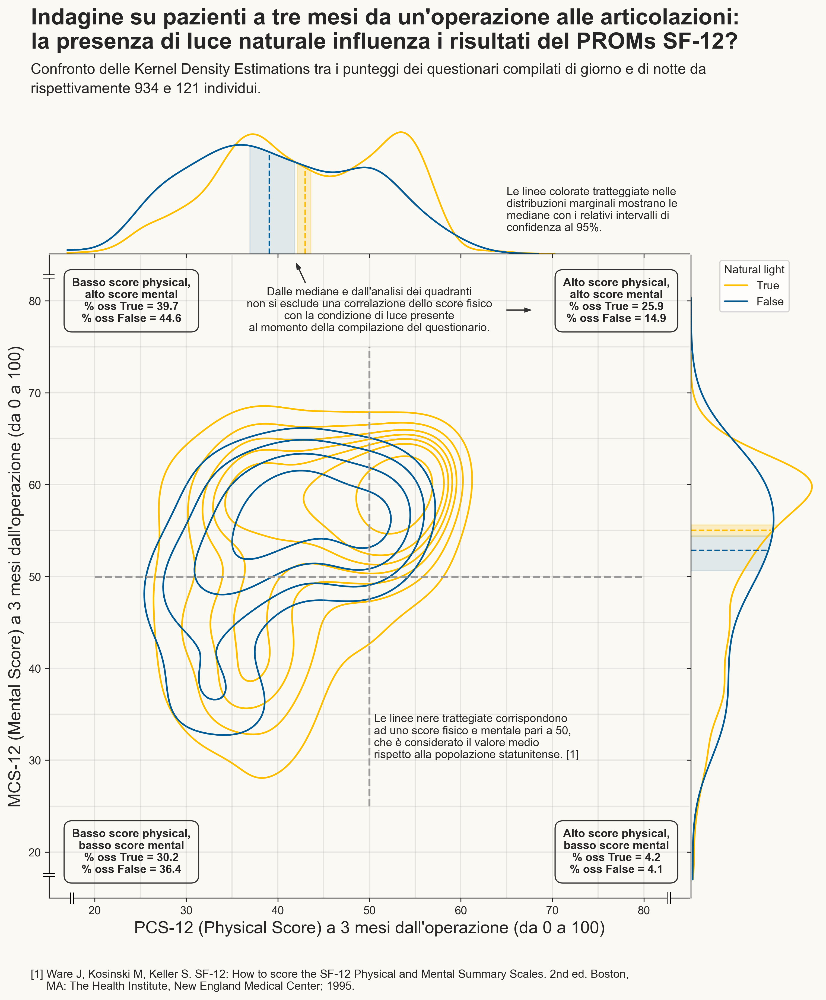
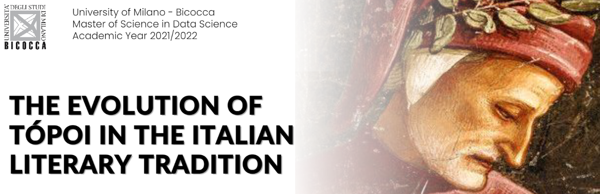

<!--
Hi Everyone! 👋 Welcome to <b><i>Fabrizio Cominetti</i></b>'s portfolio website

- 📌 Data Science at **University of Milano-Bicocca**
-->

<h1>Portfolio</h1>

---

## Data Science UniMiB

Collection of projects realized for the university courses @ University of Milano-Bicocca (2021-now).

### Machine Learning

My complete project in [***Machine Learning***](https://elearning.unimib.it/course/info.php?id=37914) by Unimib (2022).

**Credit Card Fraud Detection**: machine learning classification project realized with `Knime`

The project consists in the application of different classification models to a dataset containing data relating to credit card transactions for the detection of financial fraud.

---
### Data Management

My complete project in [***Data Management***](https://elearning.unimib.it/course/info.php?id=37922#en) by Unimib (2022).

**Competitive Pokémon Graph Database**: data management project realized with `Neo4j`

The aim of the project is to create a graph database containing all the main information useful for the competitive Pokémon game. The database was created using neo4j. The data was collected through different sources, both via API and scraping, and manually integrated. 
 
The final database contains all the information about Pokémon, moves, abilities, items, natures and their relationships.

---
### Data Visualization

My complete project and assignments in [***Data Visualization***](https://elearning.unimib.it/course/info.php?id=37786#en) by Unimib (2022).

**Air Pollution - Data Visualization**: data visualization project realized with `Tableau`

Has air quality improved in the last 15 years in and around Milan? Is the concentration of pollutants higher in winter or summer? And why? What are the main pollutants and what are the meteorological and anthropogenic factors that influence the seasonal trend of concentrations? 
 
We tried to answer these and other questions by analyzing the data of ARPA Lombardia. The results of our analysis were then displayed in an interactive infographic created using the Tableau platform.

**PROMS Score - Data Visualization**: data visualization assignment realized with `Python`

Can the physical and mental condition of a patient depend on external factors? Can weather conditions, light, humidity and temperature affect patient satisfaction with the operation they have undergone? 
 
Let’s try to answer these questions through some infographics made through Python, using the matplotlib and Seaborn libraries

---
### Data Semantics

My complete project in [***Data Semantics***](https://elearning.unimib.it/course/info.php?id=37920) by Unimib (2022).

**Evolution of tòpoi in italian literature**: data semantics project realized with `Python`

The Greek term tópoi, translated simply as "commonplace", identifies the repertoire of thematic and formal constants that constitute the morphological framework of the Western and Italian literary tradition. Although the spectrum of narrative patterns that have characterized the literature produced in the Italian peninsula is broad and changing over time, tòpos represent a form of imitatio that has never completely faded away, thus a useful tool for handing down the literary tradition. Indeed, conventionality and recurrence allow tòpos to traverse centuries and literary phases, yet lend themselves to the different formulations and interpretations of individual authors. 
 
Through the use of distributional semantics, in particular by using the algorithms word2vec and CADE, some tòpos have been analyzed from the historical and cultural point of view.

---

© 2022 Gianluca Cavallaro. Powered by Jekyll and the Minimal Theme.
