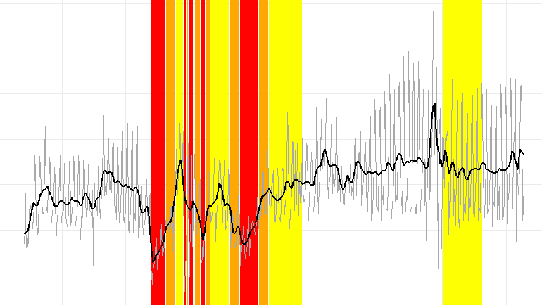
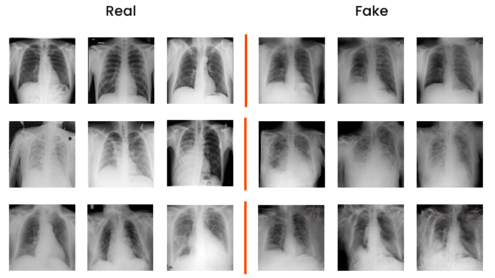

<!--
Hi Everyone! 👋 Welcome to <b><i>Fabrizio Cominetti</i></b>'s portfolio website

- 📌 Data Science at **University of Milano-Bicocca**
-->

<h1>Portfolio</h1>

---

## Data Science UniMiB

Collection of projects realized for the university courses @ University of Milano-Bicocca (2021-now).

### Machine Learning

My complete project in [***Machine Learning***](https://elearning.unimib.it/course/info.php?id=37914) by Unimib (2022).

**Credit Card Fraud Detection**: machine learning classification project realized with <code>KNIME</code>

The project consists in the application of different classification models to a dataset containing data relating to credit card transactions for the detection of financial fraud.

---
### Data Management

My complete project in [***Data Management***](https://elearning.unimib.it/course/info.php?id=37922#en) by Unimib (2022).

**Competitive Pokémon Graph Database**: data management project realized with <code>Neo4J</code>

The aim of the project is to create a graph database containing all the main information useful for the competitive Pokémon game. The database was created using neo4j. The data was collected through different sources, both via API and scraping, and manually integrated. 
 
The final database contains all the information about Pokémon, moves, abilities, items, natures and their relationships.

---
### Data Visualization

My complete project and assignments in [***Data Visualization***](https://elearning.unimib.it/course/info.php?id=37786#en) by Unimib (2022).

**Air Pollution - Data Visualization**: data visualization project realized with <code>Tableau</code>

Has air quality improved in the last 15 years in and around Milan? Is the concentration of pollutants higher in winter or summer? And why? What are the main pollutants and what are the meteorological and anthropogenic factors that influence the seasonal trend of concentrations? 
 
We tried to answer these and other questions by analyzing the data of ARPA Lombardia. The results of our analysis were then displayed in an interactive infographic created using the Tableau platform.

**PROMS Score - Data Visualization**: data visualization assignment realized with <code>Python</code>

Can the physical and mental condition of a patient depend on external factors? Can weather conditions, light, humidity and temperature affect patient satisfaction with the operation they have undergone? 
 
Let’s try to answer these questions through some infographics made through Python, using the matplotlib and Seaborn libraries

---
### Data Semantics

My complete project in [***Data Semantics***](https://elearning.unimib.it/course/info.php?id=37920) by Unimib (2022).

**Evolution of tòpoi in italian literature**: data semantics project realized with <code>Python</code>

The Greek term tópoi, translated simply as "commonplace", identifies the repertoire of thematic and formal constants that constitute the morphological framework of the Western and Italian literary tradition. Although the spectrum of narrative patterns that have characterized the literature produced in the Italian peninsula is broad and changing over time, tòpos represent a form of imitatio that has never completely faded away, thus a useful tool for handing down the literary tradition. Indeed, conventionality and recurrence allow tòpos to traverse centuries and literary phases, yet lend themselves to the different formulations and interpretations of individual authors. 
 
Through the use of distributional semantics, in particular by using the algorithms <code>word2vec</code> and <code>CADE</code>, some tòpos have been analyzed from the historical and cultural point of view.

---
### Data Science Lab

My complete project in [***Data Science Lab***](https://elearning.unimib.it/course/info.php?id=37915) by Unimib (2022).

**Restaurant's Revenue Loss during first COVID-19 pandemic lockdown: Time Series Analysis and Forecasting**: data science lab project realized with <code>R</code>

The proposed project aims to analyse the sales performance of 6 restaurants located in Lombardy and Emilia-Romagna, over a time period from January 2018 to April 2022. Through the data provided, suitably supplemented with additional useful information, the aim is to attempt to answer three questions presence of significant patterns in the time series, provide an estimate of the losses incurred during the period of closure due to the COVID-19 pandemic, and provide an estimate of future restaurant trends. This is first an exploratory analysis of the time series of the different restaurants is conducted, with the aim of identifying and explain certain behaviours, such as seasonality and trends. Subsequently, different models for analysing and forecasting time series (ARIMA & SARIMA, UCM and Random Forest). The most robust and accurate for this application turned out to be the SARIMA and Random Forest models. These were able to estimate losses of between 16% and 21% compared to the annual turnover in 2019 due to the due to the lockdown in spring 2020, and allowed the future trend of the historical series to be estimated. 

---
### Text Mining & Search

My complete project in [***Text Mining & Search***](https://elearning.unimib.it/course/info.php?id=44576) by Unimib (2023).

**Text classification and Text clustering on Amazon Fine Food Reviews dataset**: text mining & search project realized with <code>Python</code>

In this project, different text mining techniques are applied to the Amazon Fine Food Reviews dataset. In particular, the tasks of text classification and text clustering are addressed. The main questions that are being investigated are:

1) Is it possible to classify the reviews as "good" or "bad"?
2) Is it possible to predict the score assigned to the review from the text of the review itself?
3) Is it possible to group similar reviews into the same cluster?. 

---
### Digital Signal & Image Management

My complete project in [***Digital Signal & Image Management***](https://elearning.unimib.it/course/info.php?id=44564) by Unimib (2023).

**Medical data management: COVID-19 detection using cough recordings, chest X-rays classification and generation**: digital signal and image management project realized with <code>Python</code>

The project is divided into two parts: the first concerns the processing of one-dimensional signals, the second that of two-dimensional signals and the use of GANs. The first part aims to train a neural network capable of recognizing COVID-19 positive patients using cough recordings. The second part, on the other hand, aims to create a neural network capable of distinguishing healthy people, people suffering from pneumonia and COVID-19 through chest X-rays. This part also explores the possibility of using GANs to generate synthetic images with the aim of balancing the dataset and improving the performance of the classifier. 

---
### Technological Infrastructures for Data Science

My complete project in [***Technological Infrastructures for Data Science***](https://elearning.unimib.it/course/info.php?id=44575) by Unimib (2023).

**An Overview on Edge Computing Research & Applications**: an in-depth analysis on Edge Computing Paradigm

Edge computing is a computing paradigm that has become increasingly popular in recent years, as more and more devices are connected to the internet and generate massive amounts of data, and as the need for real-time data processing and analysis has grown in various industries such as healthcare, manufacturing, and transportation. 

---

© 2022 Gianluca Cavallaro. Powered by Jekyll and the Minimal Theme.

